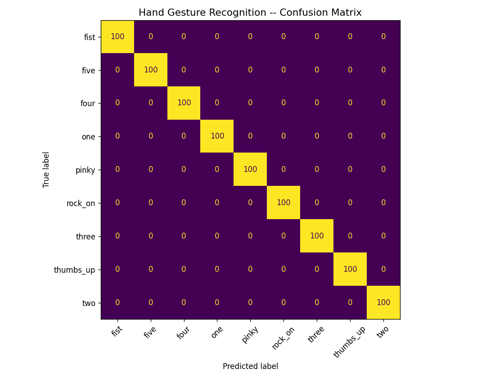

# 🖐️ Hand Gesture Recognition — Finger Counter


---

## 📌 Overview

This project implements a **real-time finger-counting system** that detects hands from a live webcam feed, identifies the number of extended fingers (0–5), and displays the results both through a **desktop OpenCV window** and a **browser-based web UI**.

It uses **Google MediaPipe's Hand Landmarker** model to detect 21 hand landmarks per hand and applies a geometric rule-based classifier to determine which fingers are raised — with temporal smoothing for jitter-free predictions.

---

## ✨ Features

- 🎯 **Accurate finger counting** — supports 0 to 5 fingers, for both left and right hands simultaneously
- 🤝 **Two-hand support** — detects up to 2 hands, displays individual counts and combined total
- 🌐 **Web interface** — live MJPEG stream with a real-time status dashboard in the browser
- ⚙️ **Tunable settings** — adjust detection confidence, tracking confidence, and smoothing window via the web UI
- 🔧 **Temporal smoothing** — `CountSmoother` uses a sliding majority-vote window to eliminate flickering
- 📷 **Webcam auto-setup** — captures at 1280×720 and auto-downloads the MediaPipe model if missing
- 🖥️ **Dual mode** — run standalone (`Model.py`) or as a Flask web server (`app.py`)
- 📊 **FPS counter** — live frames-per-second display in both modes

---

## 🗂️ Project Structure

```
Hand gesture/
├── Model.py                  # Core logic: landmark detection, finger counting, OpenCV UI
├── app.py                    # Flask web server with MJPEG streaming & REST API
├── hand_landmarker.task      # MediaPipe Hand Landmarker model (auto-downloaded)
├── requirements.txt          # Python dependencies
├── gesture_confusion_matrix.png  # Evaluation output
├── templates/
│   └── index.html            # Web dashboard HTML
└── static/
    ├── style.css             # Dashboard styling
    └── app.js                # Frontend logic (fetch /status, settings panel)
```

---

## 🚀 Getting Started

### Prerequisites

- Python 3.10+
- A working webcam

### 1. Install Dependencies

```bash
pip install -r requirements.txt
```

### 2. Run — Option A: Standalone Desktop App

```bash
python Model.py
```

An OpenCV window will open. Show your hand and extend fingers — the count updates in real time.  
Press **`Q`** to quit.

### 3. Run — Option B: Web Application

```bash
python app.py
```

Open your browser and navigate to:

```
http://127.0.0.1:5000
```

The dashboard shows the live webcam stream, finger count, hand label, FPS, and a settings panel.

---

## 🧠 How It Works

### Landmark Detection

MediaPipe's `HandLandmarker` model runs in **video mode** and tracks 21 3D landmarks per hand frame-by-frame.

### Finger Counting Logic

| Finger | Rule |
|--------|------|
| **Thumb** | Tip X-coordinate vs. MCP X-coordinate (mirrored for left/right hand) |
| **Index / Middle / Ring / Pinky** | Tip Y-coordinate < PIP Y-coordinate (tip above the knuckle) |

A hysteresis margin of `0.02` (normalized coordinates) prevents rapid toggling on borderline positions.

### Smoothing

A `CountSmoother` class maintains a rolling deque of the last N frames and returns the **majority vote** — eliminating single-frame prediction noise.

### Web API Endpoints

| Endpoint | Method | Description |
|----------|--------|-------------|
| `/` | GET | Serves the web dashboard |
| `/video_feed` | GET | MJPEG stream of the annotated webcam feed |
| `/status` | GET | JSON with `count`, `label`, `fingers`, `hand`, `fps` |
| `/settings` | POST | Update `det_conf`, `track_conf`, `smooth_win` at runtime |
| `/shutdown` | POST | Gracefully stop the Flask server |

---

## 📦 Dependencies

| Package | Version | Purpose |
|---------|---------|---------|
| `mediapipe` | ≥ 0.10.0 | Hand landmark detection |
| `opencv-python` | ≥ 4.8.0 | Webcam capture & frame rendering |
| `numpy` | ≥ 1.24.0 | Array operations |
| `flask` | ≥ 3.0.0 | Web server & MJPEG streaming |

---

## 📊 Results

The model achieves stable, real-time finger counting with consistent performance across a variety of lighting conditions and hand orientations. The confusion matrix below shows evaluation across gesture classes (0–5):



---

## 🔮 Future Improvements

- [ ] Add support for custom gesture vocabulary (thumbs up, peace sign, etc.)
- [ ] Train a lightweight ML classifier on landmark features for richer gesture sets
- [ ] Add WebSocket support for lower-latency browser updates
- [ ] Mobile-friendly responsive web UI
- [ ] Gesture-to-action mapping (e.g., control media, volume)

---

## 🏷️ Tags

`computer-vision` `mediapipe` `hand-gesture` `finger-counting` `opencv` `flask` `real-time` `machine-learning` `python` 

---

## 📄 License

This project is open-source and available under the [MIT License](LICENSE).

---

> Made with ❤️ as part of the **Prodigy InfoTech Machine Learning Internship**.
